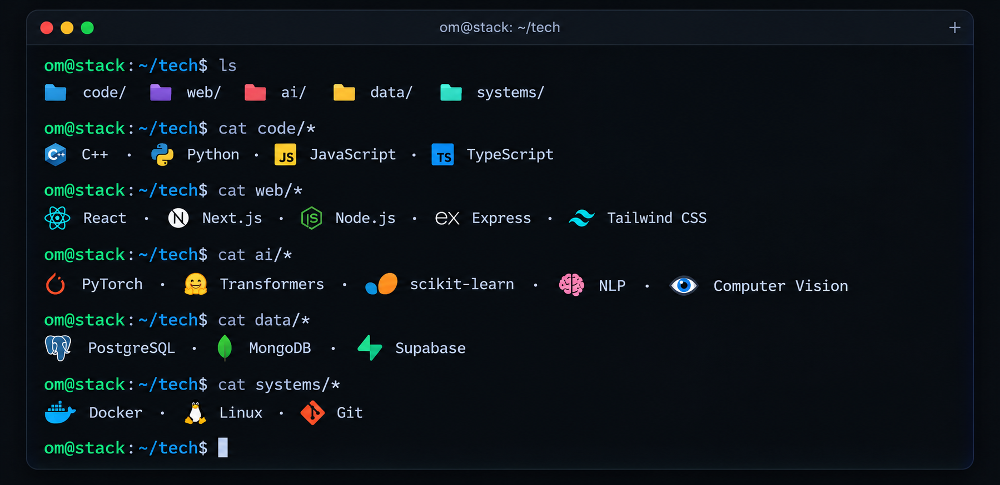

# Om Jha

### Computer Science Engineering · Data Science

<blockquote>
  <small>
    I thought I reached the bottom of the tech rabbit hole. Turns out it has a basement.
  </small>
   
  <i>(Impostor syndrome included.)</i>
</blockquote>

  
  &nbsp;&nbsp;&nbsp;&nbsp;&nbsp;&nbsp;
  

---

## About

I'm a third-year Computer Science Engineering student specializing in
Data Science.

I like working across the boundary between **software engineering and
machine learning** — building applications, experimenting with models,
and understanding what happens underneath the abstractions.

### Interests

`Machine Learning` · `Deep Learning` · `NLP` · `Computer Vision`  
`Backend Engineering` · `Data Systems` · `Algorithms`

---

## Tech Stack

  

---

## Interesting Repositories

A few things I've been building, experimenting with, or learning from.

| | Project | Stack |
|:--:|:---|:---|
| ◈ | [ShikshaNetra](https://github.com/Omvatsal/ShikshaNetra) | `Python` · `PyTorch` · `Whisper` · `MediaPipe` · `Sentence Transformers` · `FastAPI` |
| ◈ | [Library Management](https://github.com/Omvatsal/Library-Management) | `React` · `Node.js` · `Express` · `MongoDB` |
| ◈ | [Legal Query](https://github.com/Omvatsal/legal_query) | `Node.js` · `WebSockets` · `Real-time Communication` |

---

